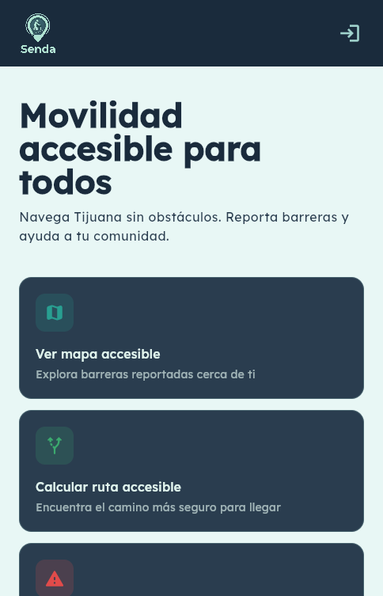
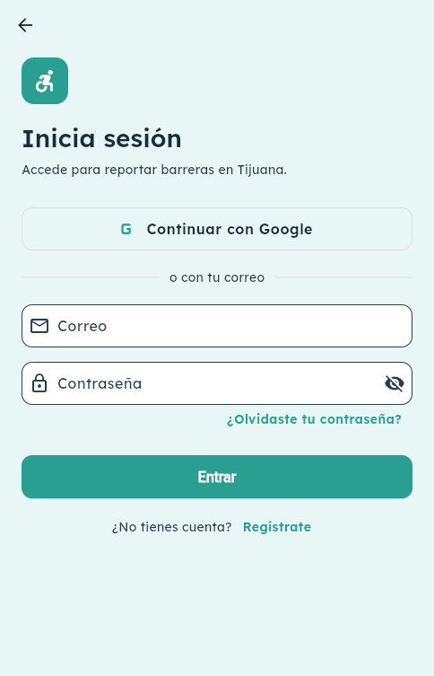
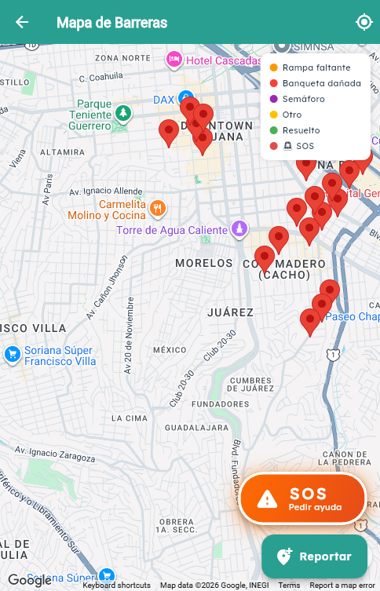
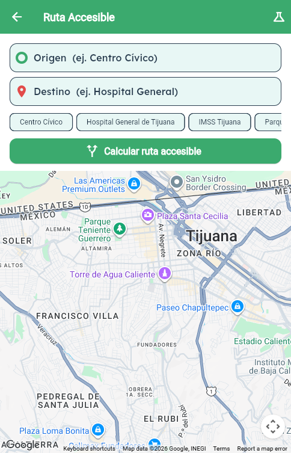
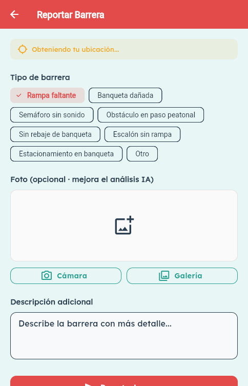

# ♿ Tijuana Sin Barreras

> Ruteo peatonal accesible y reporte ciudadano de barreras urbanas, potenciado con IA.
> **Reto "Tijuana Sin Barreras" — HackFox 2026 · Equipo Chackethon Developers**

---

## 📖 Acerca del proyecto

En Tijuana viven decenas de miles de personas con discapacidad motriz o visual. Para
ellas, un simple escalón sin rampa, una banqueta rota o un semáforo sin sonido puede
significar un rodeo de varias cuadras… o no salir de casa.

**Tijuana Sin Barreras** convierte a cada ciudadano en un sensor de accesibilidad. La app
hace tres cosas:

1. **Mapea las barreras urbanas** que la gente reporta con foto y ubicación GPS.
2. **Valida cada reporte con IA (Gemini)**: la foto se analiza automáticamente para
   confirmar que corresponde a la barrera indicada, clasificar su tipo y estimar el riesgo.
3. **Calcula rutas peatonales** hacia cualquier destino de la ciudad usando Google Maps,
   con búsqueda de lugares sesgada a Tijuana.

Todo corre sobre Firebase + Google Cloud, sin servidores propios, y la interfaz fue
diseñada con foco en accesibilidad (contraste WCAG, lectura por voz / TTS, objetivos
táctiles grandes).

---

## ✨ Características

| Función | Descripción |
|---------|-------------|
| 🗺️ **Mapa de barreras** | Marcadores en tiempo real desde Firestore, agrupados por tipo con íconos/emojis distintivos. |
| 📸 **Reporte con foto + GPS** | El usuario fotografía la barrera; se guarda la ubicación y la imagen. |
| 🤖 **Validación con Gemini AI** | `gemini-2.5-flash` verifica que la foto sea de la vía pública y corresponda al tipo seleccionado, devuelve confianza (0–100), análisis y nivel de riesgo. |
| 🧭 **Rutas peatonales** | Cálculo de ruta caminando con Google Routes API y trazado de la polilínea en el mapa. |
| 🔍 **Búsqueda de destino** | Autocompletado con Places API (New), sesgado a la zona metropolitana de Tijuana. |
| 🔊 **Accesibilidad por voz (TTS)** | Lectura en voz alta de la información para usuarios con baja visión. |
| 🆘 **Alertas de emergencia (SOS)** | Envío de una alerta con ubicación para pedir ayuda. |
| 👤 **Cuentas y roles** | Inicio de sesión con Google o email/contraseña; roles `ciudadano` y `moderador`. |
| ✅ **Verificación de reportes** | Los moderadores pueden validar reportes ciudadanos. |

---

## 📱 Capturas de pantalla

<table>
  <tr>
    <td align="center" width="33%">
      <br/>
      <sub><b>Inicio</b> — acceso a mapa, ruta y reporte</sub>
    </td>
    <td align="center" width="33%">
      <br/>
      <sub><b>Login</b> — Google o email/contraseña</sub>
    </td>
    <td align="center" width="33%">
      <br/>
      <sub><b>Mapa</b> — barreras y alertas SOS en tiempo real</sub>
    </td>
  </tr>
  <tr>
    <td align="center" width="33%">
      <br/>
      <sub><b>Ruta accesible</b> — búsqueda de origen/destino</sub>
    </td>
    <td align="center" width="33%">
      <br/>
      <sub><b>Reporte</b> — tipo de barrera, foto y descripción</sub>
    </td>
    <td align="center" width="33%"></td>
  </tr>
</table>

---

## 🏗️ Cómo se construyó

### Arquitectura

```
┌──────────────────── Flutter App (Android / Web) ────────────────────┐
│  Home · Login/Perfil · Mapa · Reporte · Ruta                        │
│  Estado con Provider · Theme accesible (Material 3, WCAG)           │
└───────────┬──────────────────────────────┬─────────────────────────┘
            │                              │
   GPS / Cámara / TTS              HTTP directo (sin backend propio)
            │                              │
            ▼                              ▼
   ┌─────────────────┐        ┌──────────────────────────────────┐
   │  Firebase        │        │  Google Cloud APIs               │
   │  • Auth          │        │  • Gemini API (validación foto)  │
   │  • Cloud         │        │  • Routes API (ruta a pie)       │
   │    Firestore     │        │  • Places API New (búsqueda)     │
   │    /barriers     │        └──────────────────────────────────┘
   │    /users        │
   │    /emergencies  │        ┌──────────────────────────────────┐
   └─────────────────┘        │  Cloud Functions (Node 20)        │
                              │  index.js · seed de demo          │
                              └──────────────────────────────────┘
```

### Decisiones técnicas relevantes

- **Foto como base64 en Firestore**, no en Firebase Storage. Storage requiere plan Blaze
  (tarjeta); para el hackathon guardamos la imagen codificada dentro del propio documento
  del reporte, manteniendo todo en el free tier.
- **Llamadas a las APIs de Google directamente desde Flutter** (Gemini, Routes, Places),
  evitando depender del despliegue de Cloud Functions durante la demo. Las Functions
  quedan disponibles para validación server-side y para el *seed* de barreras de demo.
- **Places API (New)** elegida por su soporte de CORS, lo que permite que la app funcione
  igual en web y en Android.
- **Tema accesible**: paleta con contraste WCAG AA, tipografía con `google_fonts`,
  botones de objetivo táctil amplio (≥56 px) y soporte de lectura por voz con `flutter_tts`.

### Stack

- **Frontend:** Flutter 3.x / Dart `^3.5.4` · Provider · Google Maps Flutter · Geolocator · Image Picker
- **Backend (BaaS):** Firebase Core · Auth · Cloud Firestore · (Cloud Functions Node 20)
- **IA:** Google Gemini (`gemini-2.5-flash`) vía Generative Language API
- **Mapas y ubicación:** Google Maps SDK · Routes API · Places API (New)
- **Accesibilidad:** `flutter_tts` (Text-to-Speech)

### Estructura del código

```
tijuana_sin_barreras/
├── lib/
│   ├── main.dart                       ← init Firebase + .env + runApp
│   ├── app.dart                        ← MaterialApp, theme y rutas
│   ├── firebase_options.dart
│   ├── core/
│   │   ├── constants/                  ← colores, tipografía, tipos de barrera, API keys
│   │   ├── models/                     ← barrier_report, route_result, user_profile,
│   │   │                                  place_models, emergency_alert
│   │   └── services/
│   │       ├── firebase_service.dart   ← Firestore + Auth + emergencias
│   │       ├── maps_service.dart       ← Routes API + Places API
│   │       ├── gemini_service.dart     ← validación/análisis de foto con IA
│   │       ├── geo_utils.dart          ← decode de polylines, distancias
│   │       └── tts_service.dart        ← lectura por voz
│   ├── features/
│   │   ├── auth/                       ← login, perfil, manejo de errores
│   │   ├── home/                       ← pantalla inicial
│   │   ├── map/                        ← mapa con marcadores
│   │   ├── report/                     ← formulario de reporte
│   │   └── routing/                    ← cálculo y vista de ruta
│   └── shared/widgets/                 ← logo, campo de búsqueda de lugares
├── functions/
│   ├── index.js                        ← Cloud Functions
│   └── seed_demo_barriers.js           ← carga de barreras de demostración
├── firebase.json · firestore.rules · firestore.indexes.json · storage.rules
└── pubspec.yaml
```

---

## 🚀 Instalación y ejecución

### Requisitos previos

- Flutter SDK (Dart `^3.5.4`)
- Una cuenta de Firebase con un proyecto creado (Auth + Firestore habilitados)
- API Keys de Google Cloud: **Maps Platform** (Routes + Places New) y **Gemini**
  (Google AI Studio — gratis, sin tarjeta)

### Pasos

```bash
# 1. Clonar el repositorio
git clone https://github.com/AvatoAvenue/gdg_hackfox2026.git
cd gdg_hackfox2026/tijuana_sin_barreras

# 2. Configurar variables de entorno
cp ../.env.example .env     # luego edita .env con tus claves reales

# 3. Instalar dependencias
flutter pub get

# 4. Ejecutar
flutter run                 # Android (dispositivo físico recomendado)
flutter run -d chrome       # Web
```

### Variables de entorno (`.env`)

```env
GOOGLE_MAPS_KEY=tu_key_de_google_maps
GEMINI_API_KEY=tu_key_de_gemini
FIREBASE_PROJECT_ID=tu_proyecto
FIREBASE_API_KEY=...
FIREBASE_AUTH_DOMAIN=tu_proyecto.firebaseapp.com
FIREBASE_STORAGE_BUCKET=tu_proyecto.appspot.com
FIREBASE_MESSAGING_SENDER_ID=...
FIREBASE_APP_ID=...
```

> ⚠️ Nunca subas tu `.env` ni `google-services.json` con claves reales. Usa
> `.env.example` como plantilla.

> 🗺️ **Android: el mapa también necesita la key en `android/local.properties`.**
> El `AndroidManifest.xml` lee la clave de Maps del placeholder `${GOOGLE_MAPS_KEY}`,
> que `android/app/build.gradle` toma de `android/local.properties` (NO del `.env`).
> Ese archivo está en `.gitignore` (es por máquina), así que cada quien debe agregar
> la línea manualmente o el mapa saldrá **en blanco/gris**:
>
> ```properties
> # tijuana_sin_barreras/android/local.properties
> GOOGLE_MAPS_KEY=tu_key_de_google_maps
> ```
>
> Además, el SHA-1 del keystore con el que firmas debe estar autorizado en la API key
> (Google Cloud) y en `google-services.json` (Firebase, para el login con Google).
> Obtén tu SHA-1 debug con `cd android && ./gradlew signingReport`.

### APIs de Google Cloud a habilitar

- Maps SDK for Android / Maps JavaScript API
- Routes API
- Places API (New)
- Gemini API (vía Google AI Studio)

---

## 🔌 APIs utilizadas

| API | Uso en la app |
|-----|---------------|
| **Firebase Auth** | Registro/login con Google y email/contraseña, roles de usuario. |
| **Cloud Firestore** | Persistencia de barreras, usuarios y alertas de emergencia en tiempo real. |
| **Google Gemini (2.5 Flash)** | Validación y análisis de las fotos de barreras. |
| **Google Routes API** | Rutas peatonales (`travelMode: WALK`). |
| **Google Places API (New)** | Autocompletado y geocodificación de destinos. |
| **Google Maps SDK** | Renderizado del mapa, marcadores y polilíneas. |

---

## 👥 Equipo

**Chackethon Developers** — HackFox 2026
Reto: *Tijuana Sin Barreras*

---

## 📄 Licencia

Ver el archivo [LICENSE](./LICENSE).
